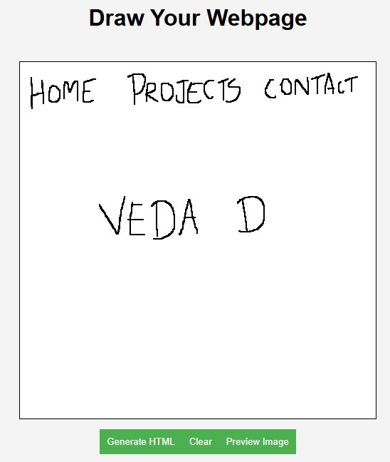
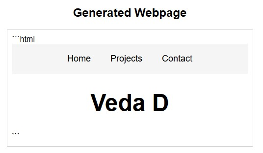

# Drawn2Code

Drawn2Code is a project that converts UI sketches into usable frontend code using multimodal large language models (LLMs). The application allows users to draw webpage designs on a canvas, processes the design using a backend powered by Ollama's Gemma model, and generates the corresponding HTML and CSS code.

## Features
- **Canvas Drawing**: Users can sketch webpage designs directly in the browser.
- **HTML & CSS Generation**: The backend processes the sketch and generates clean, semantic HTML and CSS code that replicates the design.
- **Preview Functionality**: Users can preview their sketches as images before sending them for processing.
- **Low-Memory Model Support**: The project uses Ollama's Gemma model, which is optimized for low-memory systems. However, other models can be integrated for improved accuracy if needed.

## Tech Stack
### Frontend
- **React**: For building the user interface.
- **HTML5 Canvas**: For drawing the webpage designs.
- **CSS**: For styling the application.

### Backend
- **FastAPI**: For handling API requests and managing the backend logic.
- **Ollama's Gemma Model**: For generating HTML and CSS code from the provided sketches.
- **Python**: For backend development.

### Other Tools
- **CORS Middleware**: For enabling communication between the frontend and backend.
- **Logging**: For monitoring and debugging backend processes.
## Using Ollama for Model Integration

### Model Selection
We use Ollama to fetch a list of available models and select a lightweight multimodal model, such as Gemma, optimized for low-memory systems. Multimodal models are capable of processing and understanding multiple types of data, such as images and text, making them ideal for converting UI sketches into code.

### How Multimodal Models Work
1. **Image to Description**: The sketch drawn on the canvas is sent to the backend as an image. The multimodal model processes the image and generates a textual description of the design.
2. **Description to Code**: The textual description is then used to generate clean, semantic HTML and CSS code that replicates the design.

### Ollama CLI Features
- **Model Management**: List, download, and manage models.
- **Inference**: Run models locally for tasks like text generation or image-to-text conversion.
- **Custom Models**: Integrate custom models for specific use cases.

### Running a Model with Ollama
1. List available models:
    ```bash
    ollama list
    ```
2. Run a specific model:
    ```bash
    ollama run gemma
    ```
3. Use the model in the backend to process user sketches and generate code.

Ollama simplifies the integration of advanced AI models into the project, enabling seamless processing of user inputs and efficient code generation.
## Concept
The project bridges the gap between design and development by allowing users to create webpage designs visually and automatically converting them into code. This is particularly useful for designers who want to quickly prototype ideas or developers who need a starting point for their projects.

### How It Works
1. **Draw**: Users draw their webpage design on the canvas in the browser.
2. **Send**: The sketch is sent to the backend as an image.
3. **Process**: The backend uses the Gemma model to analyze the design and generate the corresponding HTML and CSS code.
4. **Display**: The generated code is displayed in the frontend, and users can copy or preview it.

## Results
Below are some examples of designs created using Drawn2Code:

### Input Sketch:
This is an example of a webpage design drawn on the canvas by the user:


### Output generated:
Here is the HTML and CSS code generated by the LLM, rendered as a webpage:


## Getting Started
### Prerequisites
- Node.js and npm installed for the frontend.
- Python and FastAPI installed for the backend.
- OLLAMA with gemma3 to connect to the LLM for processing user request.

### Installation
1. Clone the repository:
   ```bash
   git clone https://github.com/your-username/Drawn2Code.git

### Running the project
1. Start the backend server:
    ```bash
    uvicorn server:app --reload
2. Start the frontend:
    ```bash
    npm start
